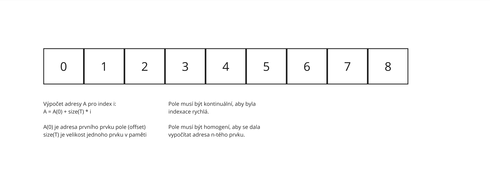
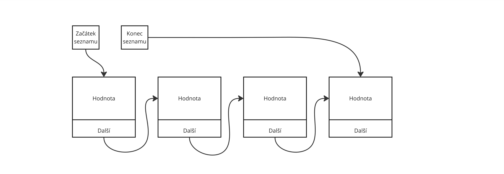
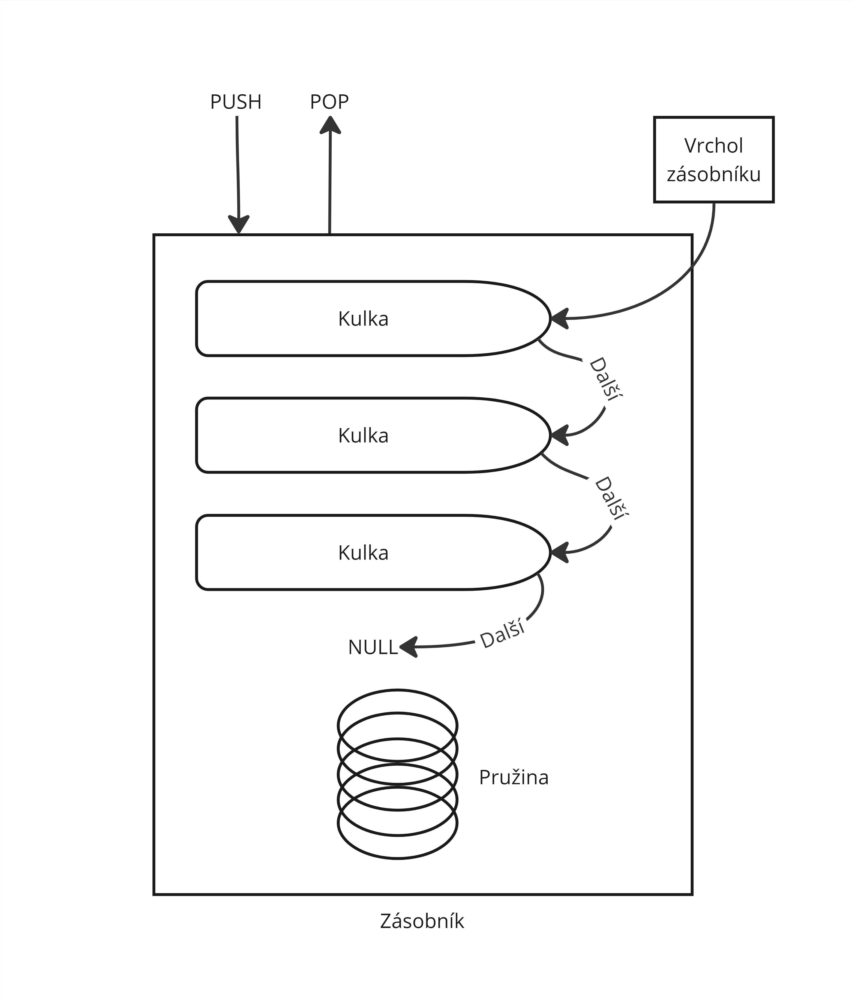
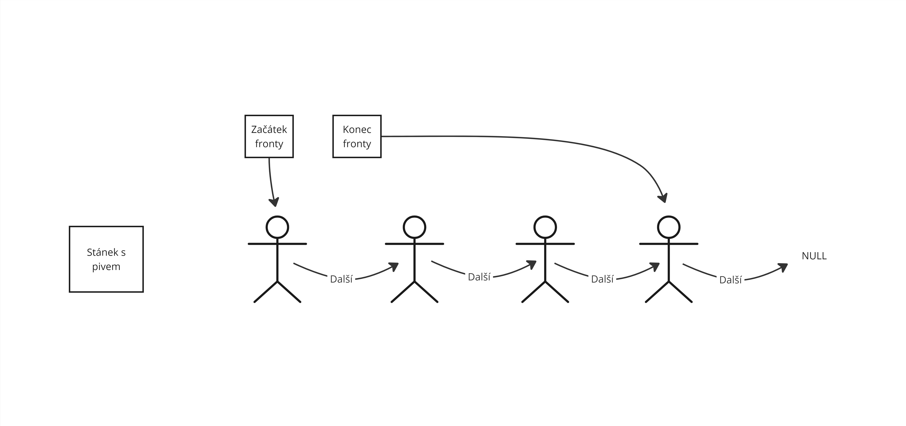
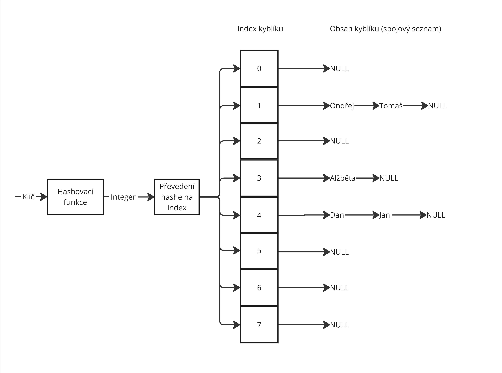

# 9. Kolekce

> Definujte pojmy kolekce, dynamické pole, seznam, zásobník, fronta, slovník. Popište jejich rozhraní a operace. Uveďte výhody a příklady aplikace jednotlivých typů kontejnerů.

---

## 📖 Slovníček pojmů

| Pojem | Co to je | Příklad z reálného světa |
| ------------------------------ | ------------------------------------------------------------------------------ | -------------------------------------------------------------- |
| **Kolekce** | Objekt pro ukládání a správu skupin dat – metody pro přidání, odstranění, vyhledávání | Košík v e-shopu – položky přidáváš, odebíráš, prohlížíš |
| **LIFO** | Last In First Out – poslední vložený = první vybraný | Hromada talířů – bereš ten nahoře (poslední položený) |
| **FIFO** | First In First Out – první vložený = první vybraný | Fronta v obchodě – kdo přišel první, ten je první obsloužen |
| **Hashovací tabulka** | Struktura pro rychlé vyhledávání podle klíče – O(1) | Rejstřík v knize – podle jména hned najdeš stránku |
| **Klíč-hodnota** | Pár: unikátní klíč identifikuje hodnotu | Slovník: slovo (klíč) → definice (hodnota) |

---

## Dynamické pole (List)

> 📋 **Přirovnání**: Jako **seznam na nákup** – můžeš přidávat položky, mažat je, vkládat uprostřed. Přístup k položce číslo 5 je okamžitý – jako když otevřeš stránku na konkrétní číslo.

- **Rozhraní**: `IList<T>`, přístup přes index, automatická realokace paměti při přidání.
- **Operace**: `Add()`, `Remove()`, `Insert()`, indexování `[i]`.
- **Složitost**: O(1) přístup k prvku podle indexu, O(n) vkládání/mazání uprostřed.

```csharp
var seznam = new List<int> { 10, 20, 30 };

seznam.Add(40);           // přidá na konec
seznam.Insert(1, 15);     // vloží 15 na index 1
seznam.Remove(20);        // odstraní prvek 20

int prvni = seznam[0];    // O(1) – rychlý přístup
Console.WriteLine(string.Join(", ", seznam));  // 10, 15, 30, 40
```

**Příklad z reálného světa**: Seznam položek v košíku – častý přístup přes index, dynamická velikost.



---

## Seznam (LinkedList)

> 🔗 **Přirovnání**: Jako **řetěz navlečených korálků** – každý uzel zná svého souseda. Přidat korálek mezi dva existující je rychlé – jen přepojíš šňůrky. Najít korálek číslo 100 vyžaduje projít 99 předchozích.

- **Princip**: Propojené uzly – každý uzel obsahuje hodnotu a referenci na další (a případně předchozí) uzel.
- **Operace**: `AddFirst()`, `AddLast()`, `AddAfter(node, value)`, `Remove(node)`.
- **Složitost**: O(1) vkládání/mazání při známém uzlu, O(n) přístup podle indexu (musíš projít uzly).

```csharp
var seznam = new LinkedList<string>();

seznam.AddLast("první");
seznam.AddLast("druhý");
seznam.AddLast("třetí");

var uzel = seznam.Find("druhý");
seznam.AddAfter(uzel, "nový");  // O(1) – vložení při známém uzlu

foreach (var polozka in seznam)
    Console.WriteLine(polozka);  // první, druhý, nový, třetí
```

**Příklad z reálného světa**: Historie operací s undo/redo – časté vkládání a mazání uprostřed, navigace mezi uzly.



---

## Zásobník (Stack)

> 📚 **Přirovnání**: Jako **hromada talířů** – položíš nový nahoru (Push), bereš vždy ten nahoře (Pop). Poslední vložený = první vybraný (LIFO).

- **Rozhraní**: LIFO (Last In First Out).
- **Operace**: `Push()` – přidá na vrchol, `Pop()` – odebere a vrátí vrchol, `Peek()` – podívá se na vrchol bez odebrání.
- **Složitost**: O(1) pro všechny operace.

```csharp
var zasobnik = new Stack<char>();

string vyraz = "((()))";
foreach (char c in vyraz)
{
    if (c == '(')
        zasobnik.Push(c);
    else if (c == ')' && zasobnik.Count > 0)
        zasobnik.Pop();
}

bool spravne = zasobnik.Count == 0;  // validace závorek
Console.WriteLine($"Závorky jsou vyvážené: {spravne}");
```

**Příklad z reálného světa**: Validace závorek v matematickém výrazu – otevírací závorka jde na zásobník, zavírací ji páruje. Rekurzivní algoritmy, backtracking, procházení složek.



---

## Fronta (Queue)

> 🎫 **Přirovnání**: Jako **fronta v obchodě** – kdo přijde první, ten je první obsloužen. První vložený = první vybraný (FIFO).

- **Rozhraní**: FIFO (First In First Out).
- **Operace**: `Enqueue()` – přidá na konec, `Dequeue()` – odebere a vrátí z předku, `Peek()` – podívá se na předek bez odebrání.
- **Složitost**: O(1) pro všechny operace.

```csharp
var fronta = new Queue<string>();

fronta.Enqueue("úloha1");
fronta.Enqueue("úloha2");
fronta.Enqueue("úloha3");

while (fronta.Count > 0)
{
    var uloha = fronta.Dequeue();
    Console.WriteLine($"Zpracovávám: {uloha}");
}
// Zpracovávám: úloha1, úloha2, úloha3 – v pořadí příchodu
```

**Příklad z reálného světa**: Tiskové úlohy – dokumenty se tisknou v pořadí odeslání. Zpracování požadavků na serveru. Plánování úloh.



---

## Slovník (Dictionary)

> 📖 **Přirovnání**: Jako **slovník cizích slov** – podle klíče (slovo) rychle najdeš hodnotu (překlad). Nemusíš procházet všechny položky.

- **Rozhraní**: Klíč-hodnota, hashovací tabulka – každý klíč je unikátní.
- **Operace**: `Add(key, value)`, `Remove(key)`, `TryGetValue(key, out value)`, indexování `[key]`.
- **Složitost**: O(1) vyhledávání podle klíče (průměrně).

```csharp
var uzivatele = new Dictionary<int, string>();

uzivatele.Add(1, "Alice");
uzivatele.Add(2, "Bob");
uzivatele.Add(3, "Cyril");

if (uzivatele.TryGetValue(2, out string jmeno))
    Console.WriteLine($"Uživatel 2: {jmeno}");  // Bob

// Přístup podle ID – O(1), ideální pro cache
foreach (var kv in uzivatele)
    Console.WriteLine($"ID {kv.Key}: {kv.Value}");
```

**Příklad z reálného světa**: Ukládání uživatelů podle ID – rychlý přístup k profilu. Cache – klíč je URL, hodnota je stažená stránka. Konfigurační parametry.



---

## Srovnání a kdy co použít

| Kolekce | Přístup | Vkládání | Typické použití |
| ------- | ------- | -------- | --------------- |
| **List** | O(1) podle indexu | O(1) na konec, O(n) uprostřed | Seznam položek, výsledky vyhledávání, stránkování |
| **LinkedList** | O(n) | O(1) při známém uzlu | Undo/redo, časté změny uprostřed |
| **Stack** | Jen vrchol | O(1) Push/Pop | Validace závorek, rekurze, backtracking |
| **Queue** | Jen předek | O(1) Enqueue/Dequeue | Fronta úloh, tisk, zpracování požadavků |
| **Dictionary** | O(1) podle klíče | O(1) | Uživatelé podle ID, cache, konfigurace |

```
┌─────────────────────────────────────────────────────────────────┐
│  KDYKOLIV POUŽÍT                                                │
│                                                                 │
│   List        →  "Potřebuji index, přístup k prvku č. 5"        │
│   LinkedList  →  "Časté vkládání/mazání uprostřed"              │
│   Stack       →  "Poslední vložený = první vybraný (LIFO)"       │
│   Queue       →  "První vložený = první vybraný (FIFO)"         │
│   Dictionary →  "Rychlé vyhledávání podle klíče (ID, název)"    │
└─────────────────────────────────────────────────────────────────┘
```

---

## Shrnutí

- **Kolekce** – objekty pro ukládání skupin dat s metodami pro manipulaci.
- **List** – dynamické pole, O(1) přístup podle indexu, vhodné pro seznamy položek.
- **LinkedList** – propojené uzly, O(1) vkládání při známém uzlu, undo/redo.
- **Stack** – LIFO, Push/Pop/Peek, validace závorek, rekurze.
- **Queue** – FIFO, Enqueue/Dequeue/Peek, tiskové úlohy, fronta požadavků.
- **Dictionary** – klíč-hodnota, O(1) vyhledávání, uživatelé podle ID, cache.

---

## Materiály od učitele

Sekce vychází z `Kolekce.txt` a `Kolekce 1.txt`.

### Varianta: `Kolekce.txt`

- Formálně rozlišuje lineární kolekce (pole, dynamické pole, linked list, stack, queue) a mapovací kolekce (dictionary).
- Zdůrazňuje typické složitosti operací a praktické použití v C# (`List<T>`, `LinkedList<T>`, `Stack<T>`, `Queue<T>`, `Dictionary<TKey,TValue>`).

### Varianta: `Kolekce 1.txt`

- Obsahově potvrzuje stejné jádro, ale je rozšířená o důraz na hashování, volbu vhodného klíče a neměnitelnost klíčů ve slovníku.
- Upozorňuje na to, že linked list má v praxi menší využití než dynamické pole, pokud nepotřebujeme časté přepojování uzlů.

### Pro ty, co chtej vedet vic

- [Kolekce.txt](Materialy/Kolekce.txt)
- [Kolekce 1.txt](Materialy/Kolekce%201.txt)
- [Pole.jpg](Materialy/Pole.jpg)
- [Spojovy-seznam.jpg](Materialy/Spojovy-seznam.jpg)
- [Zasobnik.jpg](Materialy/Zasobnik.jpg)
- [Fronta.jpg](Materialy/Fronta.jpg)
- [Slovnik.jpg](Materialy/Slovnik.jpg)
